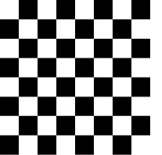
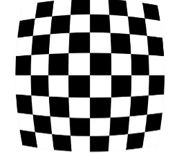
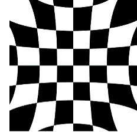
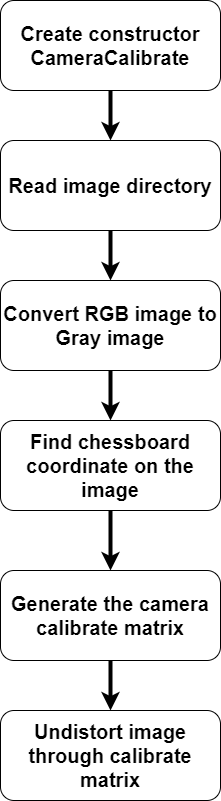
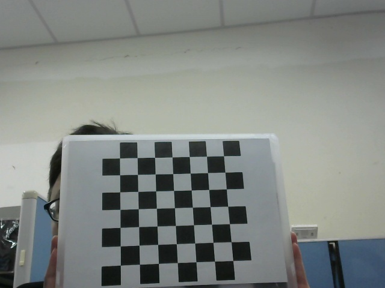
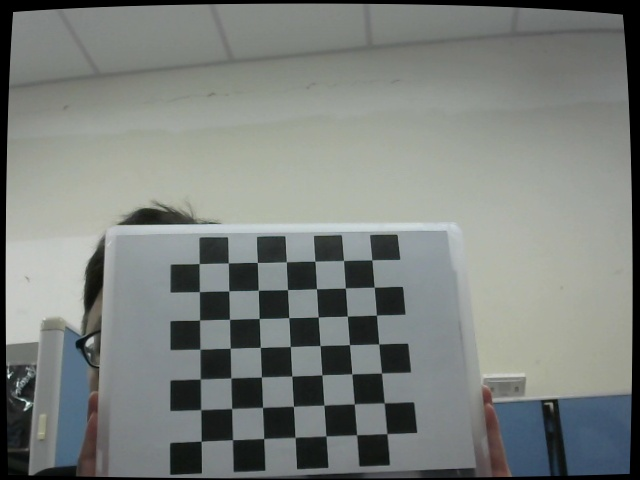
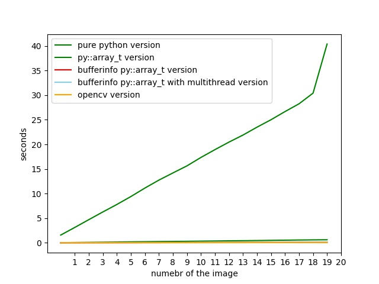

# Camera Calibrator

 ====================================================
## Basic Information

**Github repository**: https://github.com/secondlevel/Social-distance-detector

## Problem to Solve

In recent years, there are more and more deep learning methods to obtain the coordinates of objects in images or videos, such as fast-rcnn, mask-rcnn or yolo, etc. However, if these methods are used to detect the distance between bounding boxes, you will need to rely on the pixel distance captured in the picture. In actually, these pixel distances are not as perfect as expected, and they can not be directly calculated. The image captured by camera may be as shown in the figure below. The picture on the left is the case of "Normal", the picture in the middle is the case of "Positive Radial Distortation", and the picture on the right is the case of "Negative Radial Distortation". So what this project needs to do is a **camera calibration** that distorts the above-mentioned image back to normal image. 


<p float="center">
  
  
  
  
  
   
  
</p>

## Methods Description

The purpose of this project aims to calibrate the camera with a frame sequence containing a chessboard, so the input will be the image and the output will be the camera matrix. 

In order to achieve this goal, the methods can be divided into five parts:

1. Image Reader: read lots of frames from a directory.

2. Color Converter: Converts the image from RGB to grayscale.

3. Chessboard Finder: The chessboard coordinates will be retrieved from the picture.  

4. Camera Matrix Generator: The camera matrix is generated by chessboard coordinate points and real coordinate points.  

5. Image Undistort: The image will be undistorted by camera matrix and distorted coefficient. 

## Prospective Users

This tool is for those who need to calculate the distance in the picture and undistorted the image.

## System Architecture



## API Description

### CameraCalibrate  

Check the size of the chessboard you want to use and declare the constructor.  

```python=
calibrator = CameraCalibrate(7,7)
```

**GetImageNumpy()** - Read an image name and return the image numpy array.

```python=
image_array = calibrator.GetImageNumpy("image/1.jpg")
```
**GenerateCalibrateMatrix()** - Read a directory name(stored some image that named xxx.jpg) and generate the rotation vector, translation vector, intrinsic matrix, and distorted coefficient,.etc. 

```python=
calibrator.GenerateCalibrateMatrix("image")
```

**ImageUndistort()** - Read an image name or image array and return the undistorted image numpy array.

```python=
undistorted_image_array1 = calibrator.ImageUndistort("image/1.jpg")  
```
```python=
undistorted_image_array2 = calibrator.ImageUndistort(image_array)
```

**SaveUndistortedImage()** - Read the name of the image you want to save. It will save the image array to the system, such as our undistorted_image_array1 or undistorted_image_array2.

```python=
calibrator.SaveUndistortedImage("result.jpg")
```

**SaveImage()** - Read the save name and the image numpy array. It will save this array to the system.

```python=
calibrator.SaveImage("myresult.jpg", undistorted_image_array1)
```    

**ShowCalibrateResult()** - It will display both the last read image and last undistorted image, as shown in the following.

```python=
calibrator.ShowCalibrateResult()
```  

<p float="center">
  
  
  
  
  
</p>

**ShowImage()** - Read the window name and image numpy array you want to show.

```python=
calibrator.ShowImage("result_window", undistorted_image_array1)
```

**GetCameraMatrix** - Get the intrinsic matrix that can be utilize in the python opencv.

```python=
calibrator.GetCameraMatrix()
```

**GetDistCoeffs** - Get the distorted coefficient that can be utilize in the python opencv.

```python=
calibrator.GetDistCoeffs()
```

**GetRotationVector** - Get the Rotation Vector that can be utilize in the python opencv.

```python=
calibrator.GetRotationVector()
```

**GetTranslationVector** - Get the Translation Vector that can be utilize in the python opencv.

```python=
calibrator.GetTranslationVector()
```

### Additional function


**rgb2gray_c()** - Read the array of image and return the array of gray images. There using the py::array_t to implement the method.

```python=
gray_image_array = rgb2gray_c(image_array)
```

**rgb2gray2_c()** - Read the array of image and return the array of gray images. There using the bufferinfo to get the value of py::array_t.

```python=
gray_image_array = rgb2gray2_c(image_array)
```

**rgb2gray2_multithread_c()** - Read the array of image and return the array of gray images. There using the bufferinfo to get the value py::array_t, and through the multithread to implement the method.

```python=
gray_image_array = rgb2gray2_multithread_c(image_array)
```

## Engineering Infrastructure

### Version Control

- Git

### Programing Language

- c++
- python
- make
- cmake

### Make-Pybind-Pytest

- The build system were convert the c++ function into python function through make and pybind.

- The python code were tested by pytest.

### Project Step

This project will be completed by executing the following steps:

- [X] Complete the camera calibration function.

- [X] Python binding.

- [X] Final testing.

### Run System Method

step1. Prepare the directory that contain a sequence of image 

ex: [image directory](https://github.com/secondlevel/Social-distance-detector/tree/main/image)

step2. clean up all the unnecessary file or directory.

```bash=
make clean
```

step3. build the system.

```bash=
make
```

step4. test the system.

```bash=
make test
```

### Testing Content

In the project, It's using the opencv function to test my project result. Testing content or performance are as following.

#### Convert BGR to GRAY in different numbers of image.
- First column->using method
- First rows->number of image
- Unit->seconds


|Method                |1                   |2                   |3                   |4                   |5                   |6                   |7                   |8                   |9                  |10                  |11                 |12                 |13                 |14                 |15                 |16                  |17                 |18                 |19                 |20                 |
|----------------------|--------------------|--------------------|--------------------|--------------------|--------------------|--------------------|--------------------|--------------------|-------------------|--------------------|-------------------|-------------------|-------------------|-------------------|-------------------|--------------------|-------------------|-------------------|-------------------|-------------------|
|python                |1.5749773979187012  |3.121262788772583   |4.702819585800171   |6.264744758605957   |7.785413503646851   |9.395434379577637   |11.119844198226929  |12.737167358398438  |14.19506573677063  |15.627485275268555  |17.346604108810425 |18.931814908981323 |20.4638934135437   |21.8944411277771   |23.497843980789185 |25.011369228363037  |26.669386625289917 |28.25062346458435  |30.415451288223267 |40.39329290390015  |
|array_t               |0.032533884048461914|0.06439208984375    |0.0955817699432373  |0.12624526023864746 |0.15649938583374023 |0.19711780548095703 |0.22571182250976562 |0.25790858268737793 |0.2830190658569336 |0.3105607032775879  |0.34296703338623047|0.37442731857299805|0.4071354866027832 |0.4330306053161621 |0.46541666984558105|0.5054941177368164  |0.5395078659057617 |0.5722496509552002 |0.6011626720428467 |0.6252665519714355 |
|bufferinfo            |0.008468389511108398|0.011549234390258789|0.020992517471313477|0.024053573608398438|0.02918529510498047 |0.035472869873046875|0.044551849365234375|0.046608686447143555|0.05716061592102051|0.05694460868835449 |0.06218886375427246|0.06816267967224121|0.07518219947814941|0.08140850067138672|0.08457088470458984|0.0886530876159668  |0.09702539443969727|0.09924530982971191|0.10755181312561035|0.10985922813415527|
|bufferinfo_multithread|0.008541107177734375|0.017377614974975586|0.0254056453704834  |0.03266119956970215 |0.041304588317871094|0.04918718338012695 |0.05671811103820801 |0.06501269340515137 |0.07248687744140625|0.0796670913696289  |0.0879054069519043 |0.09489893913269043|0.10193276405334473|0.11264634132385254|0.1193842887878418 |0.12744545936584473 |0.13413548469543457|0.14457917213439941|0.15512919425964355|0.1593327522277832 |
|opencv                |0.003945112228393555|0.008539915084838867|0.010729074478149414|0.013991355895996094|0.01824665069580078 |0.022336721420288086|0.028447389602661133|0.02966165542602539 |0.03817629814147949|0.041345834732055664|0.04662179946899414|0.04358363151550293|0.05118727684020996|0.05533576011657715|0.05783724784851074|0.060866355895996094|0.06505465507507324|0.06884121894836426|0.07140278816223145|0.07828974723815918|

- #### BGR to Gray performance line chart


## Schedule

| Week | Schedule |                                                                                                     
| ------------- | ------------- |
| Week 1  | 1. Environment Construct<br />2. Familiar with the camera calibration method<br />3. Familiar with the Video split method<br /> |
| Week 2  | 1. Familiar with the tools<br />2. Familiar with the camera calibration method<br />3. Familiar with the Video split method<br /> |
| Week 3  | Implement VideoSplitter | 
| Week 3  | Implement VideoSplitter |
| Week 4  | Implement CameraCalibratior |
| Week 5  | Implement CameraCalibratior  |
| Week 6  | Testing function   |
| Week 7  | Build Workflow|
| Week 8  | Project Presentation  |

## References
1. [Camera calibration] https://github.com/opencv/opencv/blob/master/samples/cpp/calibration.cpp
